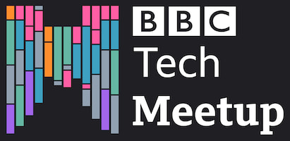

# Hi, I'm Louis 🤘🏻 👨🏻‍💻

I am a software engineer with a passion for creating exciting, performant web experiences using cutting-edge tech. Some technologies I enjoy using are React, Typescript, Redux and Machine Learning.

I work at the BBC, working on the [BBC Sounds](https://www.bbc.co.uk/sounds) website, using React, Redux, Typescript and AWS among others. 

My interest in growing the tech community and sharing ideas led me to start the [BBC Tech Meetup](http://bit.ly/bbc-tech-meetup), a meeting of minds bringing together tech talks from members of the BBC and superstars of tech from the public.

Join our community [here](https://www.meetup.com/BBC-Tech-Meetup/).

## Find me on teh interwebs

 &nbsp;&nbsp;&nbsp;&nbsp;&nbsp;&nbsp;

